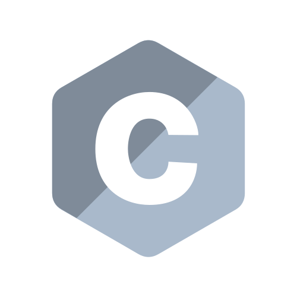
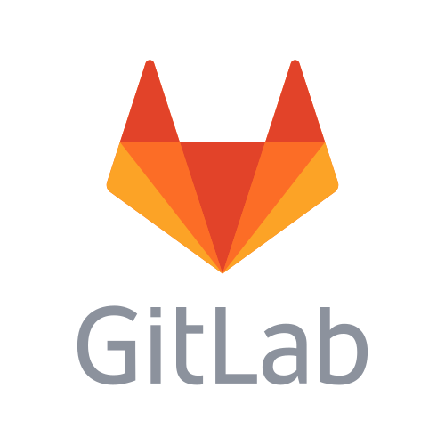

# ABOUT ME
My name is Rubén Pal**à** Vacas.

I'm a third year student at [Universitat Politècnica de Catalunya](https://www.upc.edu/ca), [Facultat de Informàtica de Barcelona](https://www.fib.upc.edu/es). 

## CODING SKILLS
My current skills are: 

   
 

In the following months, i plan to improve my skills and acquire new knowledge in the following frameworks:

 

Hopefully, in a few months the above technologies will be part of my skills!

## STATISTICS

