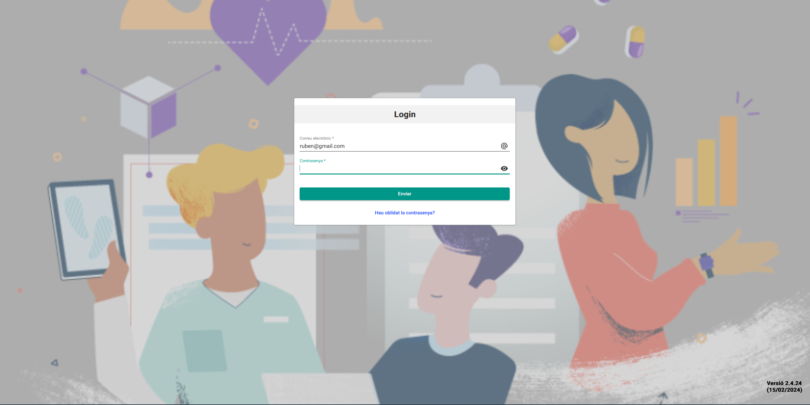
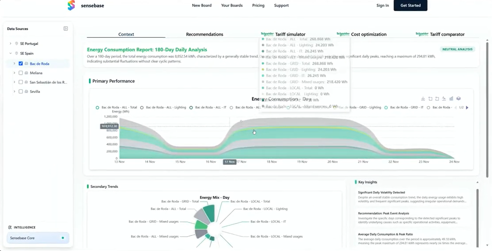
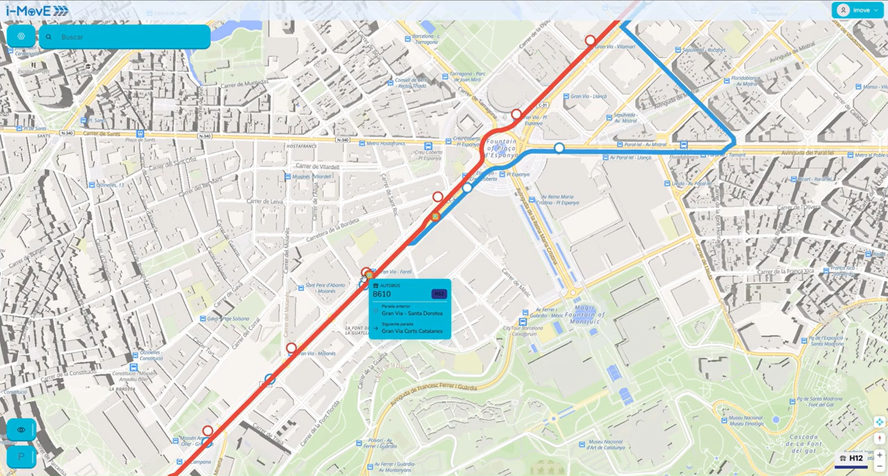
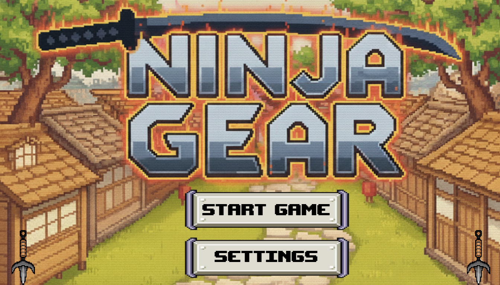

# About me 
My name is Rubén Pal**à** Vacas.

I'm a freshly graduated student at [Universitat Politècnica de Catalunya](https://www.upc.edu/ca), [Facultat d'Informàtica de Barcelona](https://www.fib.upc.edu/es).

## Technologies

A rundown of the tools and languages I've worked with across academic and professional projects. What I reach for, and why.

### Version control

<strong>Git</strong> and <strong>GitLab</strong>, daily with Gitflow-style branching. Team merges over rebases, personal opinion (sorry, rebase lovers).

 

### C & C++

Where I learned the fundamentals. Proudest project: <a href="https://github.com/DidacDV/NinjaGear-2D.git">Ninja Gear</a>, a 2D Metal Gear-inspired game.

 

### JavaScript & TypeScript

My go-to for frontend work: fast, flexible, and occasionally the source of bugs I still don't fully understand. Core to nearly every frontend I've built.

 

### Python & Java

My choice for clean, modular backends. Java pairs naturally with strong architecture; Python (especially Django) takes more deliberate structuring to hit the same bar.

 

### Deployment

<strong>Docker</strong> by default, a nice preview of the YAML complexity Kubernetes brings.

 

## Project tech stacks

### eCMR logistics application &nbsp; 

A fullstack application digitalizing the signing and management of CMR documents in logistics. Details are confidential, but this was my first production project.

 &nbsp;&nbsp;
 &nbsp;&nbsp;

 

### Healthcare survey system &nbsp; 

A survey system easing the detection of endemic diseases in migrant populations. A great reminder that the hardest part of a project isn't always the technology.

Site: [hsus.cat](https://hsus.cat/)

 &nbsp;&nbsp;
 &nbsp;&nbsp;

 

### Data integration platform prototype &nbsp; 

A prototype web platform for seamlessly integrating data sources for interpretation via LLMs. Not fully functional, but a great taste of what it's like to think like a startup founder.

Repositories: [sensebase-frontend](https://github.com/DidacDV/sensebase-frontend) (frontend) · [sensebase-backend](https://github.com/rubenpalavacas/sensebase-backend) (backend).

 &nbsp;&nbsp;
 &nbsp;&nbsp;

 

### Smart mobility services application &nbsp; 

My bachelor's thesis: a fullstack application integrating 4 mobility services, pulling data from multiple providers to improve urban efficiency in Barcelona.

**App: [imove.upcxels.upc.edu](https://imove.upcxels.upc.edu/)** · Info: [imove.upc.edu](https://imove.upc.edu/es)

 &nbsp;&nbsp;
 &nbsp;&nbsp;
 &nbsp;&nbsp;
 &nbsp;&nbsp;

 

### Metal Gear 2D spinoff &nbsp; 

A university project built with a friend: a Metal Gear clone, but with ninjas. A fun excuse to explore software patterns from [Game Programming Patterns](https://gameprogrammingpatterns.com/) and sharpen my C++ skills.

Repository: [Ninja Gear](https://github.com/DidacDV/NinjaGear-2D)

 &nbsp;&nbsp;

 
